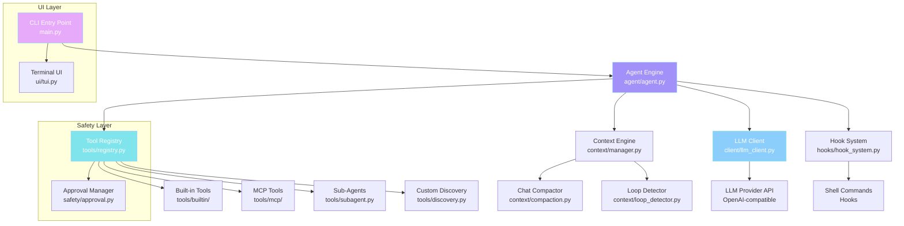
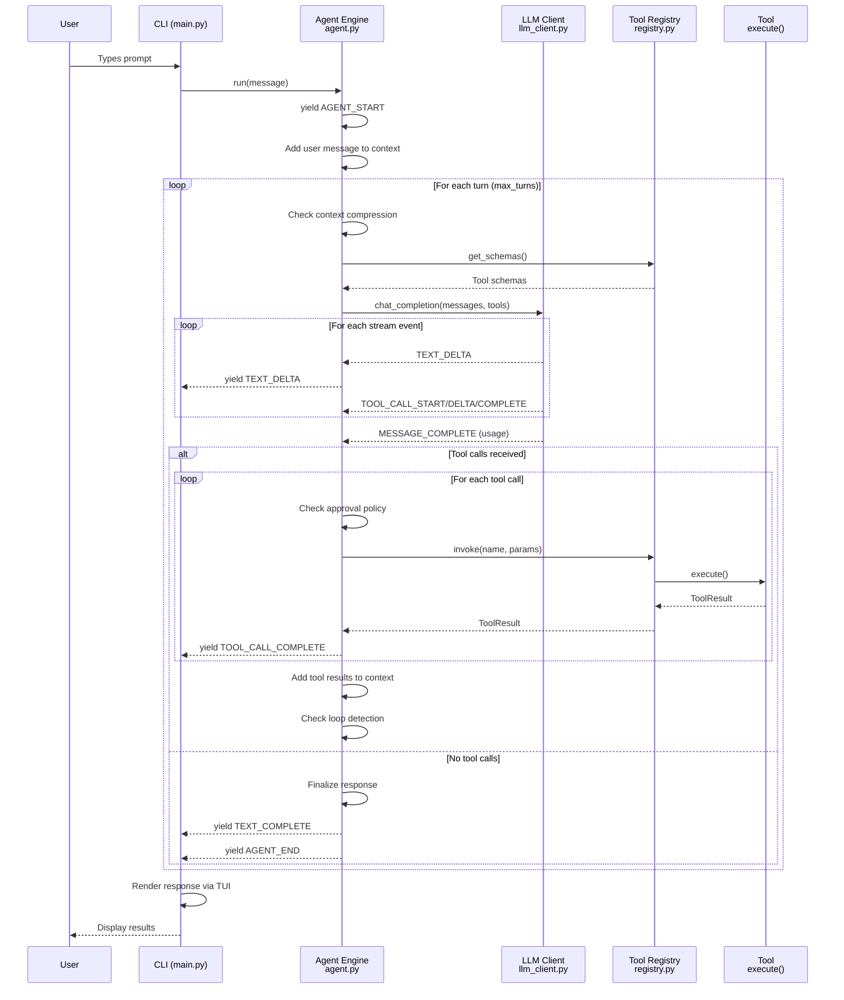
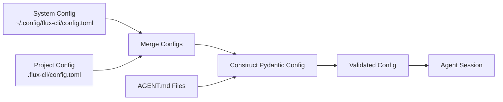

# Architecture

Flux-CLI is built using an **event-driven, multi-tiered architecture** that orchestrates LLM interactions, tool executions, background hook triggers, safety approval policies, and interactive terminal UI rendering.

## High-Level Architecture



## Component Overview

### 1. CLI Entry Point (`main.py`)

The CLI layer handles user interaction, command parsing, and session lifecycle. It uses the **Click** framework for argument parsing and the **Rich** library for the terminal UI.

**Key responsibilities:**
- Parsing command-line arguments
- Loading configuration
- Initializing the agent session
- Running the interactive REPL or single-command mode
- Handling slash commands

### 2. Agent Engine (`agent/agent.py`)

The core orchestrator that manages the multi-turn agentic loop. It is implemented as an **asynchronous generator** that yields events at every stage.

**Key responsibilities:**
- Processing user messages through the agentic loop
- Managing context compression
- Coordinating tool calls with the Tool Registry
- Streaming events to the UI layer
- Triggering lifecycle hooks

### 3. LLM Client (`client/llm_client.py`)

A wrapper around the **AsyncOpenAI** client that handles streaming, retries, and tool call parsing.

**Key design decisions:**
- **Lazy initialization** — The OpenAI client is created on first use, not at startup
- **Exponential backoff** — Retries on RateLimitError and APIConnectionError with 2^attempt delay
- **Streaming by default** — Supports both streaming and non-streaming modes
- **Tool call streaming** — Yields incremental events for tool call name, arguments, and completion

### 4. Tool Registry (`tools/registry.py`)

A central registry that manages all available tools, including built-in, MCP, custom, and sub-agent tools.

**Key design decisions:**
- **Two-tier lookup** — Built-in tools in `_tools` dict, MCP tools in `_mcp_tools` dict
- **Allowed tools filtering** — If `allowed_tools` is configured, only those tools are exposed
- **Validation pipeline** — Parameters are validated against Pydantic schemas before execution
- **Approval integration** — Mutating operations are checked against the approval policy

### 5. Safety & Approval (`safety/approval.py`)

A multi-layered safety system that protects against dangerous operations.

**Key design decisions:**
- **Pattern-based detection** — Dangerous commands are identified by regex patterns
- **Safe command whitelist** — Read-only commands are auto-approved
- **Path validation** — Operations outside the working directory require explicit approval
- **Policy enum** — 6 policies provide granular control over safety vs. convenience

## Data Flow



## Event System

The entire agent lifecycle is driven by events. The `AgentEvent` class encapsulates all event types:

```python
class AgentEventType(Enum):
    AGENT_START      = "agent_start"      # Agent starting processing
    AGENT_END        = "agent_end"        # Agent finished processing
    AGENT_ERROR      = "agent_error"      # Error occurred
    TEXT_DELTA       = "text_delta"       # Streamed response chunk
    TEXT_COMPLETE    = "text_complete"    # Full response complete
    TOOL_CALL_START  = "tool_call_start"  # Tool invocation beginning
    TOOL_CALL_COMPLETE = "tool_call_complete"  # Tool execution finished
```

## Configuration Pipeline



## Key Design Decisions

1. **Async everywhere** — The entire system is asynchronous, from the agent loop to tool execution and hook triggers
2. **Event-driven architecture** — Every component communicates through events, making the system modular and testable
3. **Lazy initialization** — Expensive resources (LLM client, MCP connections) are created on first use
4. **Multi-level config** — System, project, and CLI-level configs are merged with later ones overriding
5. **Safety by default** — The approval policy defaults to `on-request`, requiring user confirmation for mutating operations
