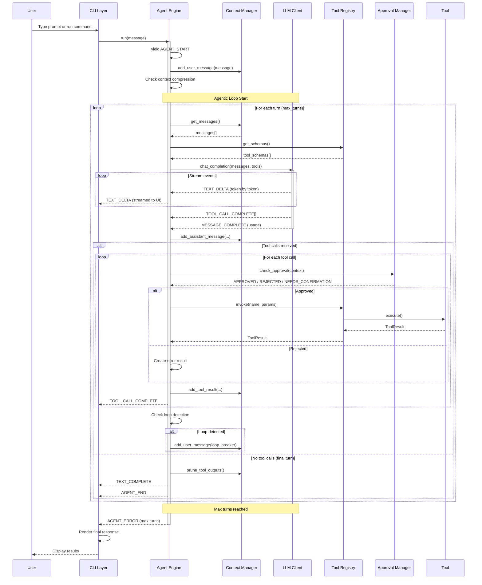

# Execution Flow

This page traces a complete request through the Flux-CLI system, from user input to final response.

## Complete Request Lifecycle

## Step-by-Step Flow

### Phase 1: Startup

1. **CLI Initialization** — `main.py` loads configuration, validates the API key, and creates a `CLI` instance
2. **Session Creation** — A `Session` object is created with the LLM client, tool registry, context manager, MCP manager, and approval manager
3. **Agent Initialization** — The `Agent` is created with the session and optional confirmation callback

### Phase 2: Message Processing

1. **User Input** — The user types a prompt (or provides it as a command-line argument)
2. **Agent Start** — The agent yields `AGENT_START` and triggers the `before_agent` hook
3. **Context Addition** — The user message is added to the context manager
4. **Agentic Loop** — The agent enters the multi-turn loop

### Phase 3: The Agentic Loop

Each turn of the loop:

1. **Context Check** — If context exceeds 80% of the window, compression is triggered
2. **Tool Schema Retrieval** — The tool registry provides OpenAI-compatible function schemas
3. **LLM Call** — The context and tool schemas are sent to the LLM
4. **Stream Processing** — Text deltas are streamed to the UI, tool calls are collected
5. **Tool Execution** — Each tool call is validated, approved, and executed
6. **Result Processing** — Tool results are added to context and loop detection is checked

### Phase 4: Completion

1. **Final Response** — When no more tool calls are needed, the final response is emitted
2. **Success Hook** — The `after_agent` hook is triggered
3. **Agent End** — The `AGENT_END` event is yielded with the final response
4. **Cleanup** — The LLM client and MCP connections are closed

## Key Design Decisions

### Why Async Generators?

The agent uses `async for ... yield` pattern instead of returning a complete response. This allows:

- **Real-time streaming** — Users see responses as they're generated
- **Incremental UI updates** — The TUI can render tool calls as they happen
- **Cancellation** — The loop can be interrupted gracefully

### Why Multi-Turn?

The agent can make multiple tool calls per turn and multiple turns per request. This enables:

- **Complex reasoning** — The agent can gather information, analyze, take action, and verify
- **Iterative refinement** — Results from one tool call inform the next
- **Autonomous problem-solving** — The agent can work through multi-step problems

### Why Max Turns?

The `max_turns` configuration prevents runaway agents. When the limit is reached:

1. An `AGENT_ERROR` is emitted
2. The `on_error` hook is triggered
3. The loop terminates gracefully
