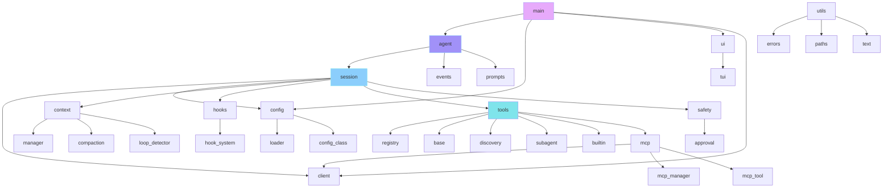

# Folder Structure

Flux-CLI follows a modular, organized structure where each component has a clear responsibility.

```
flux/
├── main.py                    # CLI entry point, Click commands, interactive REPL loop
├── pyproject.toml             # PyPI package manifest & executable entry points
├── requirements.txt           # Project dependencies
├── ARCHITECTURE.md            # Detailed technical architecture guide
├── README.md                  # Project overview and documentation
├── LICENSE                    # MIT License
│
├── agent/                     # Agent orchestration & session management
│   ├── agent.py              # The core agentic loop and event generator
│   ├── events.py             # AgentEvent & AgentEventType definitions
│   ├── session.py            # Session lifecycle (client, registry, context, MCP, hooks)
│   └── persistence.py        # Session save/load/checkpoint with atomic writes
│
├── client/                    # LLM API client
│   ├── llm_client.py         # AsyncOpenAI client wrapper with streaming & retries
│   └── response.py           # StreamEvent, TextDelta, TokenUsage, ToolCall models
│
├── config/                    # Configuration system
│   ├── __init__.py           # Package init
│   ├── config.py             # Pydantic Config, ModelConfig, HookConfig, MCPServerConfig
│   ├── loader.py             # Multi-level TOML loader & AGENT.md detection
│   └── setup.py              # First-time configuration wizard
│
├── context/                   # Context management
│   ├── manager.py            # ContextManager (history, token tracking, tool pruning)
│   ├── compaction.py         # ChatCompactor (context summarization engine)
│   └── loop_detector.py      # LoopDetector (exact repeat & cycle detection)
│
├── hooks/                     # Lifecycle hook system
│   └── hook_system.py        # Cross-platform process execution & environment builder
│
├── prompts/                   # System prompt generation
│   └── system.py             # Dynamic system prompt builder (9 sections)
│
├── safety/                    # Safety & approval system
│   └── approval.py           # ApprovalPolicy, ApprovalManager, command safety detection
│
├── tools/                     # Tool system
│   ├── base.py               # Tools ABC, ToolInvocation, ToolResult, FileDiff, ToolKind
│   ├── registry.py           # ToolRegistry (built-in & MCP lookup, validation, invocation)
│   ├── discovery.py          # Custom tool discovery from .flux-cli/tools/
│   ├── subagent.py           # SubAgentTool & pre-defined sub-agents
│   │
│   ├── builtin/              # Core built-in tools
│   │   ├── __init__.py      # Tool registration
│   │   ├── read_file.py     # Read text files with line numbers
│   │   ├── write_file.py    # Create/overwrite files
│   │   ├── edit_file.py     # Surgical text replacement
│   │   ├── shell.py         # Command execution with timeout
│   │   ├── list_dir.py      # Directory listing
│   │   ├── grep.py          # Regex search in files
│   │   ├── glob.py          # File pattern matching
│   │   ├── web_search.py    # DuckDuckGo web search
│   │   ├── web_fetch.py     # HTTP fetch with proxy fallback
│   │   ├── todo.py          # Session-scoped task tracking
│   │   └── memory.py        # Persistent user memory
│   │
│   └── mcp/                  # MCP integration
│       ├── client.py         # MCP client (stdio & SSE transport)
│       ├── mcp_manager.py    # MCPManager (connection lifecycle, tool registration)
│       └── mcp_tool.py       # MCPTool adapter (wraps MCP tools as Tools)
│
├── ui/                        # Terminal UI
│   └── tui.py                # TUI engine (gradient banner, streaming, panels, diff)
│
├── utils/                     # Utilities
│   ├── errors.py             # AgentError, ConfigError (structured error hierarchy)
│   ├── paths.py              # Path resolution, directory validation, binary detection
│   └── text.py               # Token counting (tiktoken), text truncation
│
└── scripts/                   # Utility scripts
    └── test_tool.py          # Tool testing helper
```

## Module Dependency Graph



## Key Files Explained

### `main.py` — The Entry Point

The CLI entry point handles:
- Click command parsing (`--cwd`, `config` subcommand)
- Configuration loading and validation
- Interactive REPL loop with slash commands
- Single-command execution mode
- API key onboarding flow

### `agent/agent.py` — The Brain

The core agent orchestrator:
- Implements the multi-turn agentic loop
- Manages context compression triggers
- Coordinates tool calls and approval
- Emits events for every lifecycle stage

### `agent/session.py` — The Glue

The session ties everything together:
- Creates and initializes all components
- Manages the client, registry, context, MCP, hooks
- Provides session statistics
- Handles user memory loading

### `config/config.py` — The Validator

The Pydantic configuration model:
- Defines all configuration schemas
- Validates MCP server transport (stdio vs SSE)
- Validates hook configuration (command vs script)
- Exposes API key and base URL from environment
