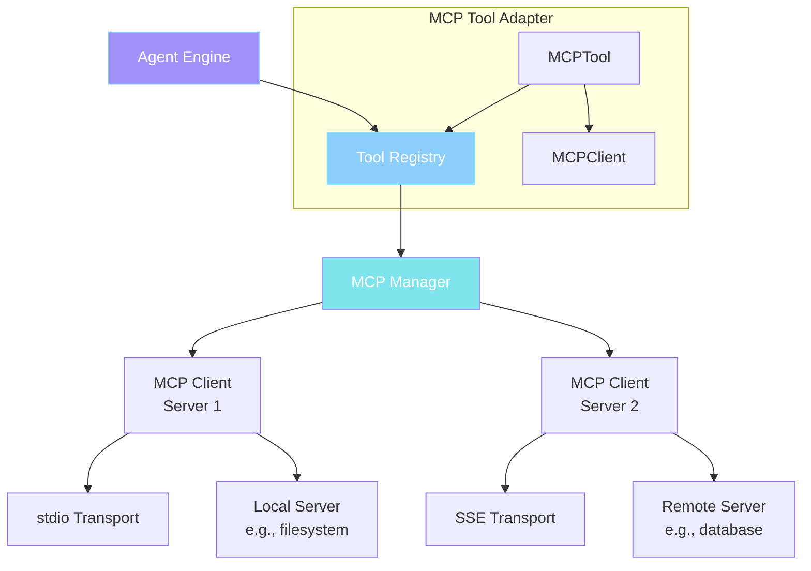

# MCP Integration

Flux-CLI supports the **Model Context Protocol (MCP)**, an open standard for connecting AI agents with external tools and data sources.

## What is MCP?

MCP (Model Context Protocol) is a protocol that allows AI applications to connect with external servers that provide tools and resources. Think of it as a "USB-C for AI" — a standardized way to plug in capabilities.

## MCP Architecture



## Transport Types

MCP supports two transport types:

### stdio Transport

For local servers that run as subprocesses:

```toml
[mcp_servers.filesystem]
command = "npx"
args = ["-y", "@modelcontextprotocol/server-filesystem"]
enabled = true
```

### SSE Transport

For remote servers accessible over HTTP:

```toml
[mcp_servers.remote]
url = "https://example.com/mcp"
enabled = true
startup_timeout_sec = 10
```

## MCP Client

<CodeExample
  title="MCP Client"
  language="python"
  code={`class MCPClient:
    def __init__(self, name: str, config: MCPServerConfig, cwd: Path):
        self.name = name
        self.config = config
        self.status = MCPServerStatus.DISCONNECTED
        self._client: Client | None = None
        self._tools: dict[str, MCPToolInfo] = {}

    def _create_transport(self) -> StdioTransport | SSETransport:
        if self.config.command:
            return StdioTransport(
                command=self.config.command,
                args=list(self.config.args),
                env=env,
                cwd=cwd_str,
            )
        else:
            return SSETransport(url=self.config.url)

    async def connect(self) -> None:
        self._client = Client(transport=self._create_transport())
        await self._client.__aenter__()
        tool_result = await self._client.list_tools()
        # Register discovered tools
        ...

    async def call_tool(self, tool_name: str, arguments: dict) -> dict:
        result = await self._client.call_tool(tool_name, arguments)
        # Format and return result
        ...
`}
  description="The MCP Client handles connection lifecycle and tool calls."
/>

## MCP Manager

The MCP Manager coordinates all MCP server connections:

```python
class MCPManager:
    async def initialize(self) -> None:
        # Connect to all configured MCP servers
        for name, server_config in mcp_configs.items():
            self._clients[name] = MCPClient(name, server_config, cwd)
        
        # Connect all servers in parallel
        await asyncio.gather(*connection_tasks)

    def register_tools(self, registry: ToolRegistry) -> int:
        # Register each MCP tool with the tool registry
        for client in self._clients.values():
            for tool_info in client.tools:
                mcp_tool = MCPTool(tool_info, client, config)
                registry.register_mcp_tool(mcp_tool)
```

## MCP Tool Adapter

MCP tools are wrapped in a `MCPTool` adapter that implements the `Tools` interface:

```python
class MCPTool(Tools):
    kind = ToolKind.MCP

    async def execute(self, invocation: ToolInvocation) -> ToolResult:
        try:
            result = await asyncio.wait_for(
                self._client.call_tool(self._tool_info.name, invocation.params),
                timeout=self._client.config.tool_timeout_sec,
            )
            if result.get('is_error'):
                return ToolResult.error_result(result.get('output', ''))
            return ToolResult.success_result(result.get('output', ''))
        except Exception as e:
            return ToolResult.error_result(f"MCP Tool failed: {e}")
```

## Configuration

MCP servers are configured in the TOML config file:

```toml
[mcp_servers.filesystem]
command = "npx"
args = ["-y", "@modelcontextprotocol/server-filesystem"]
enabled = true
startup_timeout_sec = 10
tool_timeout_sec = 120

[mcp_servers.database]
command = "python"
args = ["-m", "mcp_server"]
env = { DB_URL = "postgresql://localhost:5432/mydb" }
cwd = "/path/to/server"
enabled = true
```

## Viewing MCP Status

Use the `/mcp` slash command to see the status of connected MCP servers:

```text
❯ /mcp

MCP Servers (2)
  • filesystem: connected (12 tools)
  • database: connected (5 tools)
```

## Error Handling

MCP connection failures are handled gracefully:

1. If a server fails to connect, it's logged and the agent continues without it
2. If a tool call times out, the error is returned to the agent
3. The agent can retry or use alternative tools

<Callout type="info" title="Needs Verification">
The exact behavior of MCP reconnection and error recovery should be verified against the actual implementation, as MCP is an evolving protocol.
</Callout>
