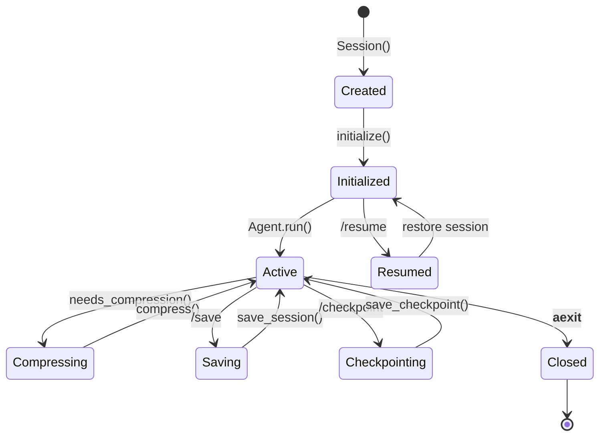

# Session Management

Flux-CLI's session management system handles the lifecycle of an agent session, including initialization, persistence, and cleanup.

## Session Lifecycle



## Session Class

The `Session` class is the central orchestrator that ties together all components:

<CodeExample
  title="Session Initialization"
  language="python"
  code={`class Session:
    def __init__(self, config: Config):
        self.client = LLMClient(config=config)
        self.tool_registry = create_default_registry(config)
        self.mcp_manager = MCPManager(config=config)
        self.chat_compactor = ChatCompactor(self.client)
        self.approval_manager = ApprovalManager(...)
        self.loop_detector = LoopDetector()
        self.hook_system = HookSystem(config)
        self.session_id = str(uuid.uuid4())
        self.created_at = datetime.now()

    async def initialize(self) -> None:
        await self.mcp_manager.initialize()
        self.discovery_manager.discover_all()
        self.mcp_manager.register_tools(self.tool_registry)
        self.context_manager = ContextManager(
            config=self.config,
            user_memory=self._load_memory(),
            tools=self.tool_registry.get_tools(),
        )
`}
  description="The Session initializes all components in the correct order."
/>

## Session Persistence

Flux-CLI supports saving and resuming sessions across invocations.

### Session Snapshot

<CodeExample
  title="Session Snapshot Schema"
  language="python"
  code={`@dataclass
class SessionSnapshot:
    session_id: str
    created_at: datetime
    updated_at: datetime
    turn_count: int
    messages: list[dict]
    total_usage: TokenUsage
`}
  description="A snapshot captures the complete session state for persistence."
/>

### Persistence Manager

<CodeExample
  title="Persistence Manager"
  language="python"
  code={`class PersistenceManager:
    def __init__(self):
        self.data_dir = get_data_dir()
        self.sessions_dir = self.data_dir / "sessions"
        self.checkpoints_dir = self.data_dir / "checkpoints"

    def save_session(self, snapshot: SessionSnapshot) -> None
    def load_session(self, session_id: str) -> SessionSnapshot | None
    def list_sessions(self) -> list[dict]
    def save_checkpoint(self, snapshot: SessionSnapshot) -> str
    def load_checkpoint(self, checkpoint_id: str) -> SessionSnapshot | None
`}
  description="The Persistence Manager handles atomic writes to disk."
/>

### Storage Location

Sessions are stored in the OS user data directory:

| OS | Path |
|---|---|
| **Linux** | `~/.local/share/flux-cli/sessions/` |
| **macOS** | `~/Library/Application Support/flux-cli/sessions/` |
| **Windows** | `%APPDATA%/flux-cli/sessions/` |

### Atomic Writes

Session files are written atomically to prevent corruption:

```python
def _atomic_write_json(self, file_path, data: dict) -> None:
    tmp_path = file_path.with_suffix(".json.tmp")
    with open(tmp_path, "w", encoding="utf-8") as fp:
        json.dump(data, fp, indent=2)
    os.replace(tmp_path, file_path)  # Atomic on POSIX
```

## Session Statistics

The session tracks usage statistics accessible via `/stats`:

<CodeExample
  title="Session Statistics"
  language="python"
  code={`def get_stats(self) -> dict:
    return {
        "session_id": self.session_id,
        "created_at": self.created_at.isoformat(),
        "turn_count": self.turn_count,
        "message_count": self.context_manager.message_count,
        "token_usage": self.context_manager.total_usage,
        "tools_count": len(self.tool_registry.get_tools()),
        "mcp_servers": len(self.tool_registry.connected_mcp_servers),
    }
`}
  description="Session statistics provide visibility into usage patterns."
/>

## User Memory

The session loads persistent user memory from a JSON file:

```python
def _load_memory(self) -> str | None:
    data_dir = get_data_dir()
    path = data_dir / "user_memory.json"
    if not path.exists():
        return None
    # Load and format memory entries
    ...
```

## Cleanup

When the session ends, resources are cleaned up in the `__aexit__` method:

```python
async def __aexit__(self, ...):
    await self.session.client.close()
    await self.session.mcp_manager.shutdown()
    self.session = None
```

## Best Practices

1. **Save frequently** — Use `/save` to preserve important sessions
2. **Use checkpoints** — Before risky operations, create a checkpoint with `/checkpoint`
3. **Monitor stats** — Check `/stats` to track token usage and avoid hitting limits
4. **Clear when stuck** — Use `/clear` if the agent gets into a bad state
5. **Resume strategically** — Resume sessions for long-running investigations
