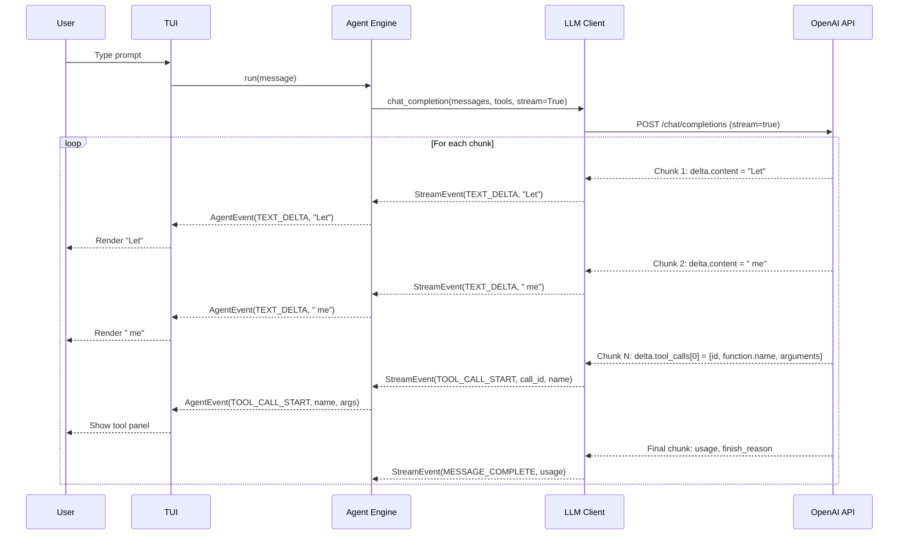

# Streaming

Streaming is a core feature of Flux-CLI that provides real-time visibility into the agent's reasoning and actions.

## Streaming Architecture



## Stream Event Types

Flux-CLI defines two levels of stream events:

### LLM-Level Events (`StreamEvent`)

```python
class StreamEventType(str, Enum):
    TEXT_DELTA = "text_delta"             # Individual text chunk
    TOOL_CALL_START = "tool_call_start"   # Tool call started
    TOOL_CALL_DELTA = "tool_call_delta"   # Arguments delta
    TOOL_CALL_COMPLETE = "tool_call_complete"  # Tool call complete
    MESSAGE_COMPLETE = "message_complete"  # Full message complete
    ERROR = "error"                       # Error occurred
```

### Agent-Level Events (`AgentEvent`)

```python
class AgentEventType(str, Enum):
    TEXT_DELTA = "text_delta"           # Streamed response chunk
    TEXT_COMPLETE = "text_complete"     # Full response complete
    TOOL_CALL_START = "tool_call_start"  # Tool invocation beginning
    TOOL_CALL_COMPLETE = "tool_call_complete"  # Tool execution finished
    AGENT_START = "agent_start"          # Agent starting processing
    AGENT_END = "agent_end"              # Agent finished processing
    AGENT_ERROR = "agent_error"          # Error occurred
```

## How Streaming Works

### 1. LLM Client Streaming

The LLM client streams from the OpenAI API:

```python
async def _stream_response(self, client, kwargs):
    response = await client.chat.completions.create(**kwargs)
    
    async for chunk in response:
        # Extract text delta
        if delta.content:
            yield StreamEvent(TEXT_DELTA, TextDelta(delta.content))
        
        # Extract tool call deltas
        if delta.tool_calls:
            for tool_call_delta in delta.tool_calls:
                # Track in-progress tool calls
                if tool_call_delta.function.name:
                    yield StreamEvent(TOOL_CALL_START, ...)
                if tool_call_delta.function.arguments:
                    yield StreamEvent(TOOL_CALL_DELTA, ...)
    
    # After stream ends, emit complete tool calls
    for tc in tool_calls:
        yield StreamEvent(TOOL_CALL_COMPLETE, ToolCall(...))
    
    yield StreamEvent(MESSAGE_COMPLETE, usage=usage)
```

### 2. Agent Event Propagation

The agent wraps LLM events into agent events:

```python
async for event in self.session.client.chat_completion(messages, tools):
    if event.type == StreamEventType.TEXT_DELTA:
        yield AgentEvent.text_delta(event.text_delta.content)
    elif event.type == StreamEventType.TOOL_CALL_COMPLETE:
        tool_calls.append(event.tool_call)
```

### 3. TUI Rendering

The TUI renders streamed content in real-time:

```python
async for event in self.agent.run(message):
    if event.type == AgentEventType.TEXT_DELTA:
        self.tui.stream_markdown_delta(content)
    elif event.type == AgentEventType.TOOL_CALL_START:
        self.tui.tool_call_start(call_id, name, kind, args)
    elif event.type == AgentEventType.TOOL_CALL_COMPLETE:
        self.tui.tool_call_complete(call_id, name, kind, success, ...)
```

## Streaming Markdown Rendering

The TUI uses Rich's `Live` display for real-time Markdown rendering:

1. `begin_streaming_markdown()` — Creates a `Live` display with an empty Markdown
2. `stream_markdown_delta(content)` — Appends content and updates the Live display
3. `end_streaming_markdown()` — Stops the Live display and renders the final Markdown

## Why Two Event Levels?

The separation between `StreamEvent` (LLM-level) and `AgentEvent` (agent-level) provides:

1. **Abstraction** — The UI doesn't need to know about LLM internals
2. **Enrichment** — Agent events can contain additional context (tool kind, approval status)
3. **Flexibility** — Different LLM providers can be adapted without changing the UI

## Tool Call Streaming

Tool calls are streamed incrementally:

1. **TOOL_CALL_START** — Emitted when the tool name is first received
2. **TOOL_CALL_DELTA** — Emitted for each chunk of arguments
3. **TOOL_CALL_COMPLETE** — Emitted when the full tool call is assembled

This allows the UI to show a tool panel immediately, even before the arguments are fully received.
