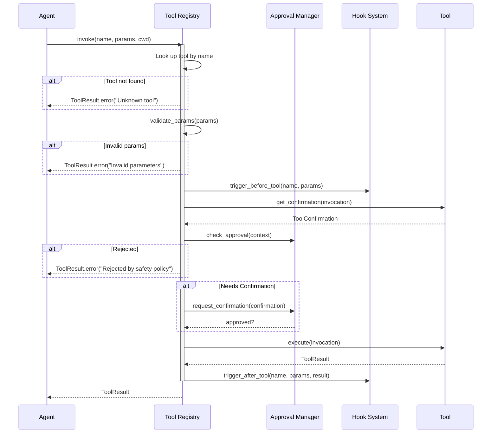

# Tool System

The tool system is one of the most important architectural components of Flux-CLI. It provides a unified interface for the agent to interact with the world.

## Tool Architecture

```mermaid
graph TB
    Agent[Agent Engine] --> Registry[Tool Registry]
    Registry --> Builtin[Built-in Tools]
    Registry --> MCP[MCP Tools]
    Registry --> SubAgent[Sub-Agent Tools]
    Registry --> Custom[Custom Discovery]
    
    subgraph "Tool Interface"
        Base[Tools ABC]
        Base --> Name[name: str]
        Base --> Desc[description: str]
        Base --> Kind[kind: ToolKind]
        Base --> Schema[schema: Pydantic Model]
        Base --> Execute[execute(invocation) -> ToolResult]
    end
    
    ToolKind[ToolKind Enum] --> READ[READ]
    ToolKind --> WRITE[WRITE]
    ToolKind --> SHELL[SHELL]
    ToolKind --> NETWORK[NETWORK]
    ToolKind --> MEMORY[MEMORY]
    ToolKind --> MCP[MCP]
    
    style Agent fill:#a191f8,stroke:#8bcefc,color:#fff
    style Registry fill:#8bcefc,stroke:#7fe4eb,color:#fff
    style Base fill:#e7aafb,stroke:#a191f8,color:#fff
```

## Tool Interface

Every tool extends the `Tools` abstract base class:

```python
class Tools(abc.ABC):
    name: str = "base_tool"
    description: str = "Base tool"
    kind: ToolKind = ToolKind.READ

    @property
    def schema(self) -> dict | type[BaseModel]:
        # Pydantic model or dict defining parameters
        ...

    @abc.abstractmethod
    async def execute(self, invocation: ToolInvocation) -> ToolResult:
        # Execute the tool with validated parameters
        ...
```

## Tool Kinds

Tools are categorized by kind, which determines their behavior:

| Kind | Description | Mutating | Examples |
|---|---|---|---|
| `READ` | Read-only operations | No | `read_file`, `grep`, `glob`, `list_dir` |
| `WRITE` | Modifies files | Yes | `write_file`, `edit` |
| `SHELL` | Executes shell commands | Maybe | `shell` |
| `NETWORK` | Network operations | No | `web_search`, `web_fetch` |
| `MEMORY` | Memory/task operations | Yes | `memory`, `todos` |
| `MCP` | External MCP tools | Configurable | MCP server tools |

## Tool Execution Flow



## Built-in Tools

Flux-CLI ships with 11 built-in tools:

### Read Tools

| Tool | Parameters | Description |
|---|---|---|
| `read_file` | `path`, `offset`, `limit` | Read text files with line numbers |
| `list_dir` | `path`, `include_hidden` | List directory contents |
| `grep` | `pattern`, `path`, `case_insensitive` | Regex search in files |
| `glob` | `pattern`, `path` | File pattern matching |

### Write Tools

| Tool | Parameters | Description |
|---|---|---|
| `write_file` | `path`, `content`, `create_directories` | Create/overwrite files |
| `edit` | `path`, `old_string`, `new_string`, `replace_all` | Surgical text replacement |

### Shell Tool

| Tool | Parameters | Description |
|---|---|---|
| `shell` | `command`, `timeout`, `cwd` | Execute shell commands |

### Network Tools

| Tool | Parameters | Description |
|---|---|---|
| `web_search` | `query`, `max_results` | DuckDuckGo web search |
| `web_fetch` | `url`, `timeout` | HTTP fetch with proxy fallback |

### Memory Tools

| Tool | Parameters | Description |
|---|---|---|
| `memory` | `action`, `key`, `value` | Persistent user memory |
| `todos` | `action`, `id`, `content` | Session-scoped task tracking |

## Custom Tool Discovery

Flux-CLI can discover custom tools from `.flux-cli/tools/` directory:

```python
class ToolDiscoveryManager:
    def discover_from_directory(self, directory: Path) -> None:
        tool_dir = directory / ".flux-cli" / "tools"
        for py_file in tool_dir.glob("*.py"):
            module = self._load_tool_modules(py_file)
            tool_classes = self._find_tool_classes(module)
            for tool_class in tool_classes:
                tool = tool_class(self.config)
                self.registry.register(tool)
```

## Sub-Agent Tools

Sub-agents are specialized agents that run with isolated context:

| Sub-Agent | Allowed Tools | Purpose |
|---|---|---|
| `codebase_investigator` | read_file, grep, glob, list_dir | Explore codebase structure |
| `code_reviewer` | read_file, grep, list_dir | Review code for issues |

## Tool Result Structure

```python
@dataclass
class ToolResult:
    success: bool              # Whether execution succeeded
    output: str                # Text output from the tool
    error: str | None          # Error message if failed
    metadata: dict             # Additional structured data
    truncated: bool            # Whether output was truncated
    diff: FileDiff | None       # File diff for write operations
    exit_code: int | None      # Exit code for shell commands
